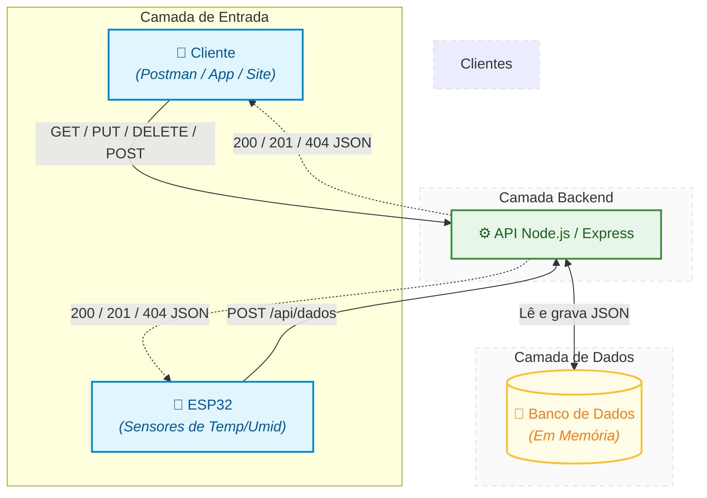

# 🔢 Atividade Teórica 01 - Documentação da API REST

**Aluno:** João Wictor Ribeiro de Matos  
**Contexto:** Conexão de Sistemas Embarcados (ESP32) com Serviços Web

---

## 📝 PARTE 1 — PESQUISA CONCEITUAL

### 1.1) O que é uma API?
Uma **API** (*Application Programming Interface*, ou Interface de Programação de Aplicações) é um conjunto de regras, protocolos e ferramentas que permite que diferentes sistemas ou aplicações de software se comuniquem entre si. A API atua como um intermediário ou uma "ponte", permitindo que um sistema solicite dados ou funcionalidades de outro, sem a necessidade de conhecer os detalhes internos da implementação do sistema que fornece as informações.

> 🍔 **Analogia Prática:** Imagine que você vai ao *drive-thru* de um fast-food. Você faz o seu pedido em uma janela (Interface). O atendente anota e avisa a cozinha (Processamento interno). Depois, ele te entrega o lanche na próxima janela. Você recebeu o que queria sem precisar entrar na cozinha ou entender como os cozinheiros se organizaram para fritar o hambúrguer.

### 1.2) O que é REST?
O **REST** (*Representational State Transfer*) funciona como um guia de boas práticas e restrições para a construção de APIs na web. Em vez de ser uma ferramenta que você instala, ele é um modelo de arquitetura de design. O REST orienta os desenvolvedores a utilizarem a estrutura padrão da própria internet, organizando o envio e o recebimento de dados de forma padronizada.

* **API RESTful:** É uma API que foi construída seguindo estritamente as regras do modelo REST. Para receber esse título, a API deve cumprir exigências importantes:
  * **Uso correto dos métodos HTTP:** Como `GET` para ler e `POST` para criar.
  * **Identificação por URIs:** Cada recurso (um usuário, uma leitura de sensor) possui um link único.
  * **Stateless (Sem Estado):** O servidor não guarda memória de interações anteriores. Cada nova requisição deve conter absolutamente todas as informações necessárias para ser processada.

### 1.3) O que é CRUD?
CRUD é um acrônimo que representa as quatro operações básicas utilizadas em bancos de dados e APIs para o gerenciamento de informações:

* ✨ **Create (Criar):** Associado ao método **HTTP POST**. No projeto, é usado para enviar novos dados coletados pelo ESP32 (como a leitura de um sensor) para o servidor.
* 📖 **Read (Ler):** Associado ao método **HTTP GET**. É usado quando o ESP32 ou o usuário solicita dados do servidor (ex: verificar o histórico de temperatura).
* 🔄 **Update (Atualizar):** Associado aos métodos **HTTP PUT** (substitui todo o registro antigo por um novo) ou **PATCH** (altera apenas uma parte específica do dado). Útil para modificar configurações remotas.
* ❌ **Delete (Excluir):** Associado ao método **HTTP DELETE**. Utilizado para apagar permanentemente um registro do sistema (ex: limpar o histórico de leituras para liberar espaço).

### 1.4) O que é HTTP e Status Codes?
O **HTTP** (*Hypertext Transfer Protocol*) é o protocolo base que permite a troca de informações na internet seguindo o modelo **Cliente-Servidor**: o cliente (como um navegador ou o ESP32) faz uma requisição (*Request*) e o servidor processa e envia uma resposta (*Response*).

Os **Status Codes** são códigos numéricos de três dígitos inclusos nessa resposta para indicar o sucesso ou falha da requisição:

| Status Code | Nome | Significado | Quando aparece no projeto? |
| :--- | :--- | :--- | :--- |
| 🟢 **200** | OK | Requisição bem-sucedida. | Ao buscar os dados com sucesso usando o `GET`. |
| 🟢 **201** | Created | Recurso criado com sucesso. | Quando o ESP32 envia um novo `POST` de leitura. |
| 🟢 **204** | No Content | Sucesso, mas sem corpo na resposta. | O servidor salvou o dado e não precisa devolver texto. |
| 🟡 **400** | Bad Request | Requisição inválida (erro do cliente). | Se faltar o campo de temperatura ou umidade no `POST`. |
| 🟡 **404** | Not Found | Recurso não encontrado. | Ao tentar acessar uma rota inexistente (ex: `/api/errada`). |
| 🔴 **500** | Internal Error | Erro interno do servidor. | Se houver uma falha catastrófica ou bug no `server.js`. |

### 1.5) O que é JSON e por que usamos?
O **JSON** (*JavaScript Object Notation*) é um formato leve de troca de dados baseado em texto estruturado em formato de `chave: valor` e listas. Apesar do nome, ele é independente de linguagem de programação.


**Exemplo de JSON do nosso projeto:**
```json
{
  "temperatura": 25.5,
  "umidade": 60,
  "data_hora": "2026-05-15T10:00:00Z"
}
```

---

## 🚀  Parte2 Endpoints da API 

### 📡 GET /api/dados
- Descrição: Retorna todos os registros de histórico de sensores.
- Parâmetros: nenhum.
- Exemplo de requisição:
  - URL: `http://localhost:3000/api/dados`
- Exemplo de resposta de sucesso:
  - Status: `200 OK`
  - Body:
    ```json
    [
      {"id": 1, "temperatura": 30, "umidade": 40, "hora": "09:00"},
      {"id": 2, "temperatura": 25, "umidade": 56, "hora": "10:00"},
      {"id": 3, "temperatura": 20, "umidade": 30, "hora": "11:00"}
    ]
    ```

### 📡 GET /api/dados/:id
- Descrição: Retorna o registro de sensor com o `id` informado.
- Parâmetros:
  - `id` (path): identificador do registro.
- Exemplo de requisição:
  - URL: `http://localhost:3000/api/dados/2`
- Exemplo de resposta de sucesso:
  - Status: `200 OK`
  - Body:
    ```json
    {"id": 2, "temperatura": 25, "umidade": 56, "hora": "10:00"}
    ```
- Exemplo de resposta de erro:
  - Status: `404 Not Found`
  - Body:
    ```json
    {"mensagem": "ID não enontrado!"}
    ```

### 📡 POST /api/dados
- Descrição: Cria um novo registro de sensor.
- Parâmetros: nenhum no path; body JSON obrigatório com `temperatura`, `umidade` e `hora`.
- Exemplo de requisição:
  - URL: `http://localhost:3000/api/dados`
  - Body:
    ```json
    {
      "temperatura": 28,
      "umidade": 45,
      "hora": "12:00"
    }
    ```
- Exemplo de resposta de sucesso:
  - Status: `201 Created`
  - Body:
    ```json
    {
      "mensagem": "Dados enviados com sucesso!",
      "dados": {"id": 4, "temperatura": 28, "umidade": 45, "hora": "12:00"}
    }
    ```
- Exemplo de resposta de erro:
  - Status: `400 Bad Request`
  - Body:
    ```json
    {"mensagem": "Dados incompletos! Verifique novamente!!"}
    ```

### 📡 PUT /api/dados/:id
- Descrição: Atualiza o registro de sensor com o `id` informado.
- Parâmetros:
  - `id` (path): identificador do registro.
- Exemplo de requisição:
  - URL: `http://localhost:3000/api/dados/2`
  - Body:
    ```json
    {
      "temperatura": 26,
      "umidade": 50,
      "hora": "10:30"
    }
    ```
- Exemplo de resposta de sucesso:
  - Status: `200 OK`
  - Body:
    ```json
    {"mensagem": "dados atualizados com sucesso!"}
    ```
- Exemplo de resposta de erro:
  - Status: `404 Not Found`
  - Body:
    ```json
    {"mensagem": "Não é possivel atualizar"}
    ```

### 📡 DELETE /api/dados/:id
- Descrição: Remove o registro de sensor com o `id` informado.
- Parâmetros:
  - `id` (path): identificador do registro.
- Exemplo de requisição:
  - URL: `http://localhost:3000/api/dados/3`
- Exemplo de resposta de sucesso:
  - Status: `200 OK`
  - Body:
    ```json
    {"mensagem": "Dados excluídos com sucesso"}
    ```
- Exemplo de resposta de erro:
  - Status: `404 Not Found`
  - Body:
    ```json
    {"mensagem": "Não é possivel excluir um dado inexistente!"}
    ```

---

## 🧭 Parte 3 - Diagrama de fluxo do sistema

A seguir, o fluxo completo do sistema incluindo o ESP32, a API Node.js/Express, o banco de dados em memória e o cliente (Postman ou app/site futuramente):


### 📋 Legenda do fluxo
- O `ESP32` envia leituras de temperatura e umidade para a API via `POST /api/dados`.
- O `Cliente` (Postman ou app/site) consome a API com `GET`, `POST`, `PUT` e `DELETE` em `/api/dados`.
- A `API` processa as requisições e usa o banco de dados em memória para armazenar ou recuperar registros.
- O `Cliente` e o `ESP32` recebem respostas da API em formato JSON.

---

## 📦 PARTE 4 — COMO RODAR E REFLEXÃO

### 🛠️ 4.1) Como rodar
- Pré-requisitos:
  - Node.js (v18.x ou superior): O ambiente de execução para rodar o código JavaScript no servidor.
  - NPM (Node Package Manager): O gerenciador de pacotes (que já vem instalado junto com o Node) necessário para baixar o Express e outras dependências.
  - Postman (ou Insomnia): Ferramenta de cliente HTTP essencial para simular as requisições (GET e POST) e testar a API antes de conectar o ESP32 real.
  - Editor de Código (Ex: VS Code): O ambiente de desenvolvimento para visualizar e editar o código do server.js.
  - Git (Opcional, mas necessário para a entrega): Para versionar o código e enviar o projeto para o GitHub.

- Como instalar dependências:
  - Execute `npm install` na pasta do projeto.
- Como rodar:
  - Execute `node server.js`.
- Como saber que está funcionando:
  - O terminal deve exibir algo como `servidor rodando na porta 3000`.
- Como testar com Postman:
  - Abra o Postman e faça uma requisição `GET http://localhost:3000/api/dados`.
  - Você deve receber a lista de leituras JSON.
  - Para testar `POST`, use `http://localhost:3000/api/dados` com body JSON contendo `temperatura`, `umidade` e `hora`.

### 💻 4.2) Tecnologias usadas
- Node.js — ambiente que executa nosso JavaScript no servidor.
- Express — framework para criar rotas HTTP e responder requisições de forma simples.
- CORS — lib que permite o cliente acessar a API mesmo vindo de outra origem.
- JSON — formato de dados usado para enviar e receber leituras de sensores.
- Memória do servidor — armazenamento temporário dos registros de sensores enquanto o servidor estiver rodando.

### 🧠 4.3) Reflexão
- O que eu mais gostei de fazer nessa atividade foi criar a API e ver como as rotas REST conectam o ESP32, o servidor e o cliente em um fluxo claro.
- A maior dificuldade foi entender como montar e documentar corretamente as rotas e como organizar os exemplos de requisição e resposta para serem fáceis de testar.


  
